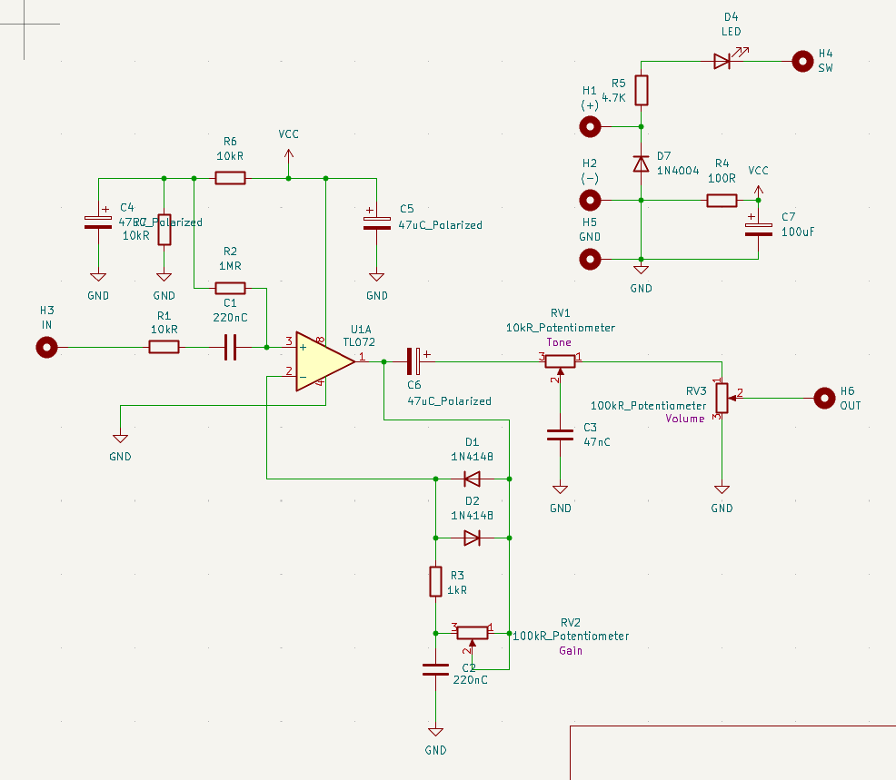

# Custom Overdrive Guitar Pedal

## Overview
Designing and building a custom analog overdrive guitar pedal. This project covers the entire hardware development timeline, including simulating circuit performance in NI Multisim, breadboarding and testing physical components, designing the schematic and custom PCB layout in KiCad, manufacturing the PCBs, and using a CNC machine for the final enclosure build.

---

## Key Features & Circuit Architecture
* **Dual Op-Amp Core:** Built around a **TL072 dual op-amp IC**.
* **Soft-Clipping Distortion:** Has a warm tube-like overdrive sound by putting clipping diodes within the non-inverting feedback loop.
* **Adjustable Gain (0–40 dB):** Dedicated gain potentiometer to control the crunch.
* **Variable Tone Stack:** Variable low-pass filter stage to allow the user to control high-frequency response.
* **Master Volume Control:** Variable voltage divider output stage to set the final signal level at the end of the circuit.

---

## Design & Prototyping Stages
1. **Simulation (Multisim):** Verified frequency response, gain curves, and distortion characteristics (`Overdrive Pedal Design 1.ms14`).
2. **Breadboard Prototyping:** Assembled and tested the physical circuit on a breadboard to test the real performance.
3. **Schematic & PCB Layout (KiCad):** Translated the verified design into a schematic (`Pedal.kicad_sch`) and custom PCB layout with generated Gerber files.
4. **Manufacturing & Assembly:** Ordered and received the PCBs, aiming to solder and test soon.

---

## Project Media

### Schematic Design (KiCad)

### PCB Layout & Design

---

## Component List
* **Op-Amp:** TL072 Dual Op-Amp IC
* **Diodes:** 1N4148 (x2), 1N4004 (x1)
* **Resistors:** 10k (x3), 4.7k (x1), 1x (x1), 1M (x1), 100 (x1)
* **Capacitors:** Polarized 47u (x3), 220n (x2), Polarized 100u (x1), 47u (x1)
* **Pots:** 10k (Tone), 100k (Gain), 100k (Volume)
* **Other:** Runs on a standard 9V power supply (barrel jack).

## Tech Stack & Tools
* **Simulation & Analysis:** NI Multisim
* **Schematic & PCB CAD:** KiCad
* **Manufacturing:** Custom PCB through JLCPCB & CNC Enclosure Machining from a friend

## Acknowledgments
* Circuit architecture and design concepts inspired by technical design breakdowns from **Wampler Pedals**.
